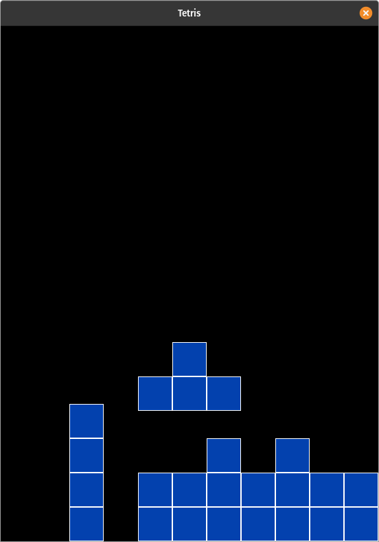

# SDL Tetris

An implementation of classic [Tetris game](https://en.wikipedia.org/wiki/Tetris) in C programming language using [SDL-2 library](https://www.libsdl.org/)



## Installation

Clone this repository to your system:

```sh
git clone https://github.com/olzhasar/sdl-tetris.git
```

Install sdl2 libraries

MacOS:

```sh
brew install sdl2 sdl2_image sdl2_ttf
```

Compile the project code

```sh
cd sdl-tetris
make
```

Run the executable

```sh
./game
```

## TODO

- Optimize data structures
- Score calculation
- Port to WASM
