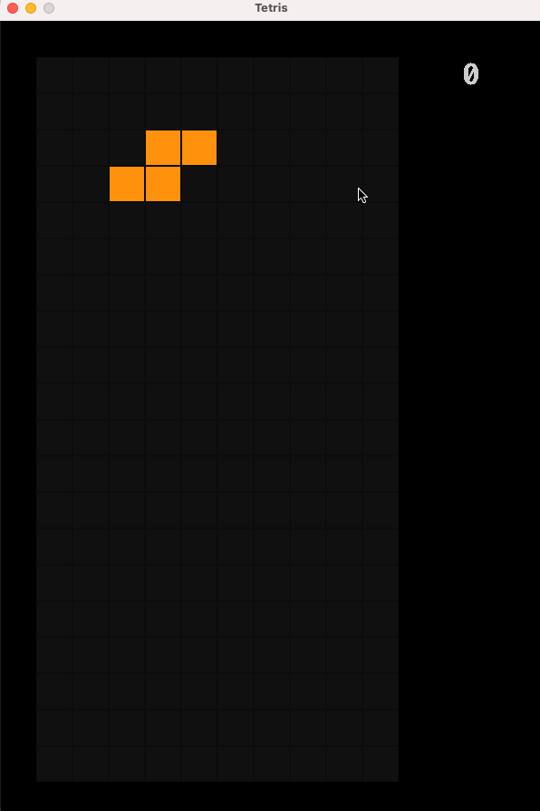

# SDL Tetris

An implementation of the classic [Tetris game](https://en.wikipedia.org/wiki/Tetris) in the C programming language using the [SDL-2 library](https://www.libsdl.org/)

## WebAssembly

The game has been ported to WebAssembly using [Emscripten](https://emscripten.org/)

Check out the [Live Demo](https://olzhasar.github.io/sdl-tetris/)

## Desktop preview



## Installation

1. Clone this repository to your system:

```sh
git clone https://github.com/olzhasar/sdl-tetris.git
```

2. [Install](https://wiki.libsdl.org/SDL2/Installation) SDL2 and SDL2_ttf on your machine

- On MacOS you can use Homebrew:

```sh
brew install sdl2 sdl2_ttf
```

3. Compile and run the project code with make

```sh
cd sdl-tetris
make
```

## Controls

- Rotate: Up arrow, W
- Move Left: Left arrow, A
- Move Right: Right arrow, D
- Soft Drop: Down arrow, S
- Hard drop: Space
- Quit: ESC

## License

This project is licensed under the MIT License - see the [LICENSE](LICENSE) file for details.
